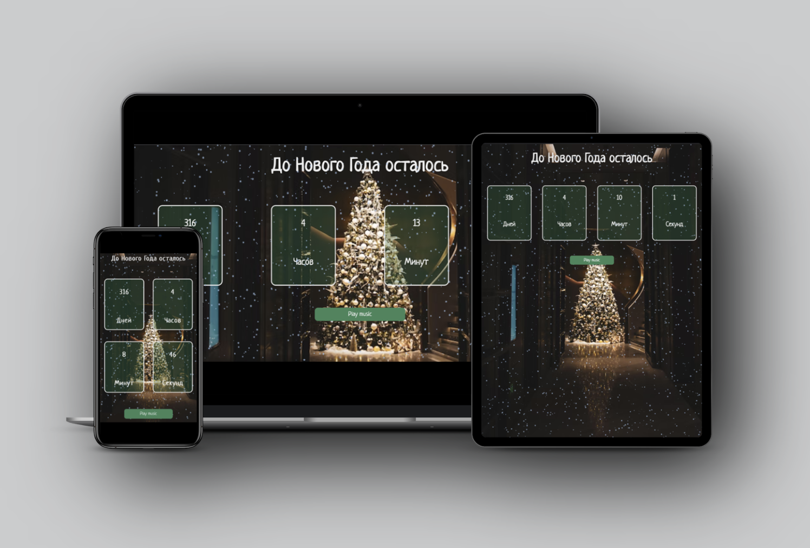

<h1 style="color: navy; background-color: #D4E2D4;" align="center">Hi there, I'm <a href="https://irina-narin-portfolio.glitch.me/" target="_blank">Irina</a> 
 <br>I am a student. Now I am learning <span style="color: red;">React</span></h1>


## ___<span style="color:#0B666A;">New Year Countdown</span>___
---




_This project was created using <span style="color:red">HTML, CSS, JavaScript</span> ._
___
### **Project Overview**
The New Year countdown is a simple web application that counts down to new year from today's date
using HTML5 and vanilla JS.

It uses `Date()` object in Javascript which provides methods like `.getFullYear()`,`.getMonth()
`, etc., to get current time information of user device or system clock.

 The code then calculates the difference between two dates (current day & 12/31), subtracts it by a specified number of days . 

 Finally, an interval function runs every
second until the remaining seconds reaches zero at midnight on December 31st.

 At this pointit triggers another event listener that displays "Happy New Year!" message with celebration music playing!


___Below you can see how the app works:___


___

[Visit website](https://new-year-2023-countdown.glitch.me/)

```
This project was created for educational purposes.
```
